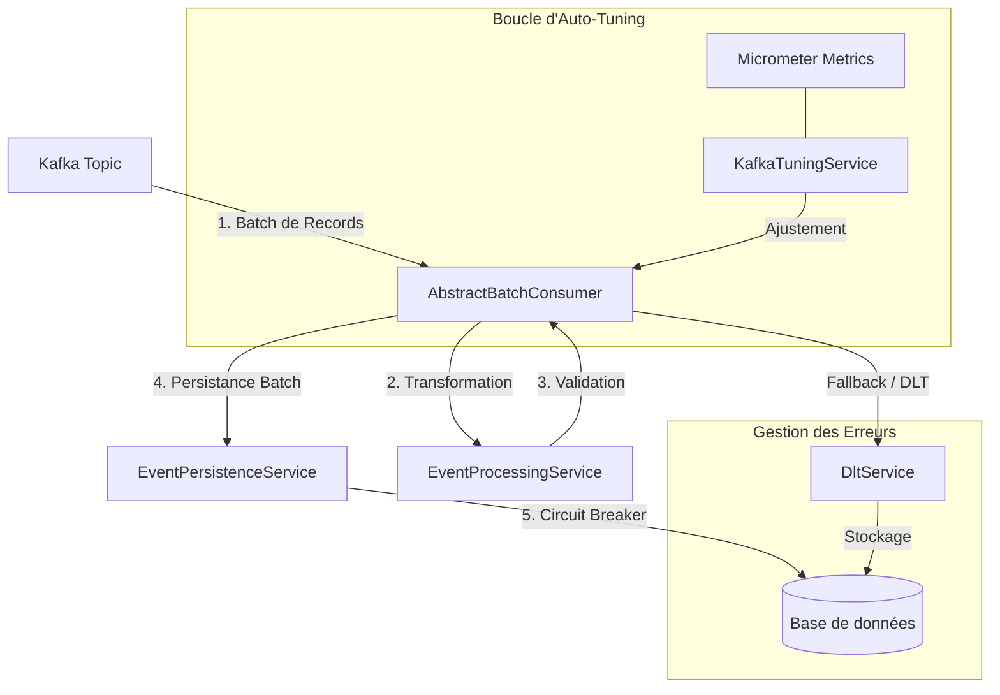

# Documentation Technique - Kafka Consumer Auto-tune

## 1. Résumé Exécutif
KafkaConsumerAutoTune est une application Spring Boot de haute performance conçue pour consommer des messages Kafka en mode batch, les traiter, et les persister. L'application se distingue par son moteur d'**auto-tuning** intelligent basé sur un contrôleur PID qui ajuste dynamiquement les paramètres pour optimiser le débit. Elle intègre une gestion avancée des erreurs (DLT, Fallback), une protection par **Circuit Breaker**, et une pile d'observabilité complète (Loki, Prometheus, Jaeger, Grafana).

**Documents complémentaires :**
- [Gestion des Erreurs et Résilience](docs/error-management.md)
- [Observabilité (Logging, Tracing, Métriques)](docs/observability.md)

---

## 2. Architecture Globale

L'application suit une architecture modulaire. Les données circulent comme suit :

---

## 3. Composants Clés en Détail

### 3.1 Consommation Kafka (AbstractBatchConsumer)
Gère le cycle de vie du traitement batch avec une généricité totale (`<T>`).
-   **Standardisation** : Routage DLT, métriques, et logs structurés automatiques.
-   **Classification d'Erreurs** : Distingue les erreurs permanentes (envoi direct en DLT) des erreurs transitoires (déclenchement du retry Kafka).

### 3.2 Moteur d'Auto-Tune (KafkaTuningService)
Surveille le débit et ajuste les paramètres pour atteindre une cible de **1,2 seconde** par batch.
-   **Contrôleur PID** : Utilise la formule `P*error + I*integral + D*derivative` pour ajuster `max.poll.records`. L'erreur est calculée comme `(Target - Actual) / Target`.
-   **Optimisation Réseau** : Ajuste dynamiquement `fetch.min.bytes`, `fetch.max.wait.ms` et `fetch.max.bytes` en fonction du débit (msg/s) et de la taille moyenne des messages.
-   **Scaling Horizontal Interne** : Ajuste la `concurrency` (nombre de threads) en fonction de la charge CPU et du lag Kafka, sans dépasser le nombre de partitions.
-   **Lissage (EMA)** : Applique un coefficient de lissage (alpha=0.2 par défaut) sur la durée des batchs pour éviter les sur-réactions aux pics de latence.
-   **Throttling de Survie** : Si le CPU ou la Mémoire dépassent 90%, le système réduit immédiatement `max.poll.records` de 30% pour éviter un crash.

### 3.3 Résilience et Circuit Breaker
Protège la persistance via Resilience4j.
-   **Circuit Breaker** : Bascule en `OPEN` en cas de défaillance DB.
-   **Auto-Pause/Reprise** : Le consommateur Kafka s'arrête et redémarre automatiquement selon l'état du circuit.
-   **Fallback Chirurgical** : En cas d'échec de batch, l'application tente chaque message individuellement pour isoler les "poison messages" vers la DLT tout en sauvant le reste du lot.

---

## 4. Observabilité et Supervision

### 4.1 Pile de Centralisation
-   **Logs** : Centralisés dans **Loki** via Promtail. Format JSON ELK/ECS nativement supporté.
-   **Traces** : Exportées vers **Jaeger** via OTLP.
-   **Corrélation** : Support des **Exemplars** Prometheus permettant de passer d'un graphique de métriques à une trace Jaeger d'un seul clic.

### 4.2 Monitoring et Alerting
-   **Tableaux de bord** : Dashboard Technique et Dashboard Business KPI provisionnés dans Grafana.
-   **Alertes** : Définies dans `prometheus-rules.yml` sur le lag Kafka, le taux d'erreur et la performance des batchs.

---

## 5. Spécifications Techniques
-   **Langage** : Java 25 (Utilisation des `record`).
-   **Framework** : Spring Boot 3.5.9.
-   **Base de données** : Oracle (ou H2 en profil dev).
-   **Infrastructure** : Docker Compose prêt pour la production (Prometheus, Loki, Jaeger, Grafana).
