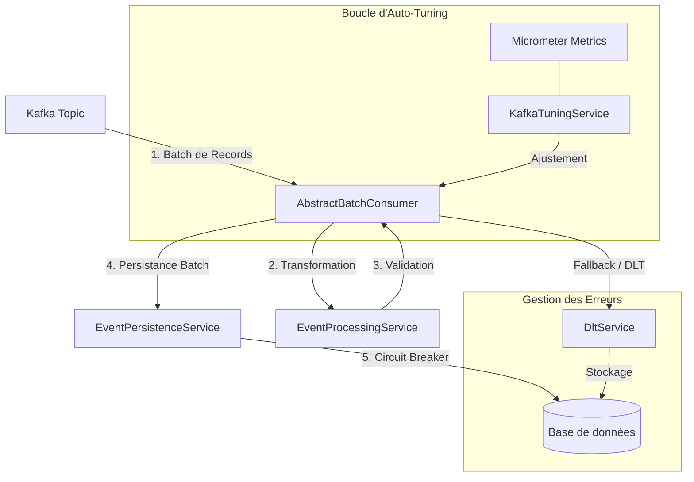

# Documentation Technique - Kafka Consumer Auto-tune

## 1. Résumé Exécutif
KafkaConsumerAutoTune est une application Spring Boot de haute performance conçue pour consommer des messages Kafka en mode batch, les traiter, et les persister. L'application se distingue par son moteur d'**auto-tuning** intelligent basé sur un contrôleur PID qui ajuste dynamiquement les paramètres pour optimiser le débit. Elle intègre une gestion avancée des erreurs (DLT, Fallback), une protection par **Circuit Breaker**, et une pile d'observabilité complète (Loki, Prometheus, Jaeger, Grafana).

**Documents complémentaires :**
- [Référence de Configuration](docs/configuration.md)
- [Gestion des Erreurs et Résilience](docs/error-management.md)
- [Observabilité (Logging, Tracing, Métriques)](docs/observability.md)

---

## 2. Architecture Globale

L'application suit une architecture modulaire. Les données circulent comme suit :



---

## 3. Composants Clés en Détail

### 3.1 Consommation Kafka (AbstractBatchConsumer)
Gère le cycle de vie du traitement batch avec une généricité totale (`<T>`).
-   **Standardisation** : Routage DLT, métriques, et logs structurés automatiques.
-   **Classification d'Erreurs** : Distingue les erreurs permanentes (envoi direct en DLT) des erreurs transitoires (déclenchement du retry Kafka).

### 3.2 Moteur d'Auto-Tune (KafkaTuningService)
Surveille le débit et ajuste les paramètres pour atteindre une cible de **1,2 seconde** par batch.
-   **Contrôleur PID** : Utilise la formule `P*error + I*integral + D*derivative` pour ajuster `max.poll.records`. L'erreur est calculée comme `(Target - Actual) / Target`.
-   **Optimisation Réseau** : Ajuste dynamiquement `fetch.min.bytes`, `fetch.max.wait.ms` et `fetch.max.bytes` en fonction du débit (msg/s) et de la taille moyenne des messages.
-   **Scaling Horizontal Interne** : Ajuste la `concurrency` (nombre de threads) en fonction de la charge CPU et du lag Kafka, sans dépasser le nombre de partitions.
-   **Lissage (EMA)** : Applique un coefficient de lissage (alpha=0.2 par défaut) sur la durée des batchs pour éviter les sur-réactions aux pics de latence.
-   **Throttling de Survie** : Si le CPU ou la Mémoire dépassent 90%, le système réduit `max.poll.records` de 30% pour éviter un crash.
-   **Mesure sur intervalle** : La durée des batchs et la taille des messages sont mesurées sur la fenêtre écoulée depuis le cycle précédent, et non sur toute la vie du process. Le contrôleur continue ainsi de réagir aux conditions courantes, au lieu d'une moyenne cumulée qui s'aplatit à mesure que le process tourne.
-   **Cooldown de redémarrage** : Appliquer un paramètre redémarre le container listener, les changements sont donc soumis à `min-restart-interval-ms` (5 minutes par défaut). Un changement proposé pendant cette fenêtre est abandonné plutôt que mis en file, puis re-proposé au cycle suivant à partir de mesures fraîches. Rien n'est inscrit dans l'état interne tant que la valeur n'a pas atteint la consumer factory : le dashboard et le health indicator `kafkaTuning` décrivent donc toujours ce que le consumer exécute réellement. Le throttling d'urgence est soumis au même cooldown.

L'ensemble des paramètres et leurs valeurs par défaut sont détaillés dans la [Référence de Configuration](docs/configuration.md#2-auto-tuning-kafkatuning).

### 3.3 Résilience et Circuit Breaker
Protège la persistance via Resilience4j.
-   **Circuit Breaker** : Bascule en `OPEN` en cas de défaillance DB.
-   **Auto-Pause/Reprise** : Le consommateur Kafka s'arrête et redémarre automatiquement selon l'état du circuit.
-   **Fallback Chirurgical** : En cas d'échec de batch, l'application tente chaque message individuellement pour isoler les "poison messages" vers la DLT tout en sauvant le reste du lot.

---

## 4. Observabilité et Supervision

### 4.1 Pile de Centralisation
-   **Logs** : Centralisés dans **Loki** via Promtail. Format JSON ELK/ECS nativement supporté.
-   **Traces** : Exportées vers **Jaeger** via OTLP.
-   **Corrélation** : Support des **Exemplars** Prometheus permettant de passer d'un graphique de métriques à une trace Jaeger d'un seul clic.

### 4.2 Monitoring et Alerting
-   **Tableaux de bord** : Dashboard Technique et Dashboard Business KPI provisionnés dans Grafana.
-   **Alertes** : Définies dans `prometheus-rules.yml` sur le lag Kafka, le taux d'erreur et la performance des batchs.

---

## 5. Spécifications Techniques
-   **Langage** : Java 21 (Utilisation des `record`).
-   **Framework** : Spring Boot 3.5.9.
-   **Base de données** : Oracle (ou H2 en profil dev).
-   **Infrastructure** : Docker Compose prêt pour la production (Prometheus, Loki, Jaeger, Grafana).

---

## 6. Build et Tests

```bash
./mvnw verify            # suite complète, tests d'intégration inclus
./mvnw spring-boot:run   # exécution locale sur le profil dev (H2 en mémoire)
```

Les tests d'intégration utilisent un broker Kafka embarqué et H2 plutôt que Testcontainers : aucun
démon Docker n'est requis. `verify` est ce qu'exécute la CI sur chaque push et chaque pull request.

À noter : l'image Docker se construit avec `-DskipTests`. Elle empaquette un artefact déjà testé et
ne constitue pas elle-même un garde-fou de test.

---

## 7. Schéma de Base de Données

Le profil Oracle tourne avec `ddl-auto: validate` : le schéma doit correspondre exactement aux
entités, sinon l'application ne démarre pas. `init.sql` fait référence et est idempotent — il crée
les tables et séquences manquantes et met à niveau un schéma existant.

### Mise à niveau d'un schéma Oracle existant

Ré-exécutez `init.sql` sur le schéma applicatif. Le script va :

- ajouter `DLT_EVENTS.SEVERITY` et `DLT_EVENTS.ORIGINAL_KEY` si absentes ;
- convertir `DLT_EVENTS.PAYLOAD` et `DLT_EVENTS.ERROR_MESSAGE` de `VARCHAR2(4000)` vers `CLOB` ;
- créer `RECOUVRABLE_EVENTS` et `RECOUVRABLE_SEQ` si absentes.

La conversion CLOB reconstruit chaque colonne — ajout d'une CLOB, copie des données, suppression de
l'originale, renommage — car Oracle refuse un `ALTER TABLE ... MODIFY` direct de `VARCHAR2` vers un
type LOB (ORA-22858). **Faites une sauvegarde avant de l'exécuter sur une table peuplée.**

### Une faiblesse à connaître

Les profils `dev`, `local-h2` et `test` génèrent leur schéma depuis les entités
(`ddl-auto: create-drop`), tandis que la production valide contre ce DDL écrit à la main. Rien dans
la suite de tests n'exerce ce second chemin : un écart entre une entité et `init.sql` ne sera donc
pas détecté par les tests — il se manifestera par un échec au démarrage, ou par une insertion qui
échoue seulement lorsqu'une valeur dépasse la largeur déclarée. Vérifiez les deux lors de la
modification d'une entité.
