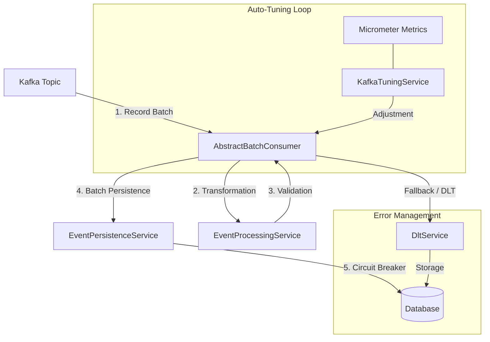

# Technical Documentation - Kafka Consumer Auto-tune

## 1. Executive Summary
**KafkaConsumerAutoTune** is a high-performance Spring Boot application designed to consume Kafka messages in batch mode, process them, and persist them. The application stands out for its intelligent **auto-tuning** engine based on a PID controller that dynamically adjusts parameters to optimize throughput. It integrates advanced error management (DLT, Fallback), protection via **Circuit Breaker**, and a complete observability stack (Loki, Prometheus, Jaeger, Grafana).

**Complementary Documents:**
- [Error Management and Resilience](docs/error-management.md)
- [Observability (Logging, Tracing, Metrics)](docs/observability.md)

---

## 2. Overall Architecture

The application follows a modular architecture. Data flows as follows:

---

## 3. Key Components in Detail

### 3.1 Kafka Consumption (AbstractBatchConsumer)
Manages the batch processing lifecycle with total genericity (`<T>`).
-   **Standardization**: Automatic DLT routing, metrics, and structured logs.
-   **Error Classification**: Distinguishes permanent errors (direct send to DLT) from transient errors (triggering Kafka retry).

### 3.2 Auto-Tune Engine (KafkaTuningService)
Monitors throughput and adjusts parameters to reach a target of **1.2 seconds** per batch.
-   **PID Controller**: Uses the formula `P*error + I*integral + D*derivative` to adjust `max.poll.records`. The error is calculated as `(Target - Actual) / Target`.
-   **Network Optimization**: Dynamically adjusts `fetch.min.bytes`, `fetch.max.wait.ms`, and `fetch.max.bytes` based on throughput (msg/s) and average message size.
-   **Internal Horizontal Scaling**: Adjusts `concurrency` (number of threads) based on CPU load and Kafka lag, without exceeding the number of partitions.
-   **Smoothing (EMA)**: Applies a smoothing coefficient (default alpha=0.2) on batch duration to avoid over-reacting to latency spikes.
-   **Survival Throttling**: If CPU or Memory exceeds 90%, the system immediately reduces `max.poll.records` by 30% to avoid a crash.

### 3.3 Resilience and Circuit Breaker
Protects persistence via Resilience4j.
-   **Circuit Breaker**: Switches to `OPEN` in case of DB failure.
-   **Auto-Pause/Resume**: The Kafka consumer automatically stops and restarts according to the circuit state.
-   **Surgical Fallback**: In case of batch failure, the application attempts each message individually to isolate "poison messages" to the DLT while saving the rest of the batch.

---

## 4. Observability and Supervision

### 4.1 Centralization Stack
-   **Logs**: Centralized in **Loki** via Promtail. JSON ELK/ECS format natively supported.
-   **Traces**: Exported to **Jaeger** via OTLP.
-   **Correlation**: Support for Prometheus **Exemplars** allowing to jump from a metrics graph to a Jaeger trace with a single click.

### 4.2 Monitoring and Alerting
-   **Dashboards**: Technical Dashboard and Business KPI Dashboard provisioned in Grafana.
-   **Alerts**: Defined in `prometheus-rules.yml` on Kafka lag, error rate, and batch performance.

### 4.3 Built-in Web Console
Beyond the Grafana stack, the application serves its own operator console on
port 8080. It is not a second monitoring system: it exposes what only the
consumer itself knows — the decisions the optimizer took, and the messages it
could not process.

| Route | Purpose |
| --- | --- |
| `/` | Pipeline overview: throughput, success rate, consumer lag, and the parameters currently applied |
| `/optimizer` | Every PID adjustment, with the measurement that triggered it |
| `/dlt-management` | Failed messages: inspect headers and error trace, correct the payload, replay or discard |
| `/consumer-groups` | Group state and lag broken down per partition |
| `/message-viewer` | Payload of the last messages consumed, with comparison between two of them |
| `/metrics` | Every registered Micrometer meter, searchable |
| `/simulation` | Traffic generator, to exercise the consumer without a producer |
| `/db-status`, `/settings`, `/architecture` | Connection pool, effective configuration, C4 diagrams |

The console pushes its updates over WebSocket rather than polling, serves all of
its assets itself — no CDN, so it works air-gapped — and its stylesheet is
compiled at build time (see `docs/frontend-build.md`).

Screenshots: `docs/images/`.

---

## 5. Technical Specifications
-   **Language**: Java 25 (Use of `record`).
-   **Framework**: Spring Boot 3.5.9.
-   **Database**: Oracle (or H2 in dev profile).
-   **Infrastructure**: Production-ready Docker Compose (Prometheus, Loki, Jaeger, Grafana).
