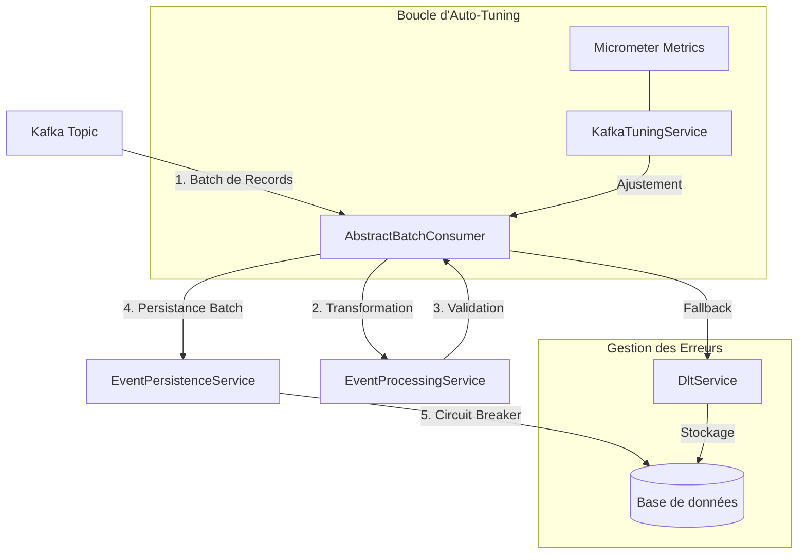

# Documentation Technique - Kafka Consumer Auto-tune

## 1. Résumé Exécutif
Consotopic est une application Spring Boot de haute performance conçue pour consommer des messages Kafka en mode batch, les traiter, et les persister dans une base de données (Oracle/H2). L'application se distingue par son moteur d'**auto-tuning** intelligent basé sur un contrôleur PID qui ajuste dynamiquement les paramètres du consommateur Kafka pour optimiser le débit et la latence en temps réel. Elle intègre également un système robuste de gestion des erreurs via une Dead Letter Topic (DLT), un mécanisme de résilience par repli (fallback), une protection par **Circuit Breaker**, et un tableau de bord complet de monitoring.

**Documents complémentaires :**
- [Modèles C4 (Architecture - PlantUML)](docs/c4-models.md)
- [Modèles C4 (Architecture - Mermaid)](docs/c4-mermaid.md)
- [Gestion des Erreurs et Résilience](docs/error-management.md)
- [Observabilité (Logging & Tracing)](docs/observability.md)

---

## 2. Architecture Globale

L'application suit une architecture orientée services et modulaire. Voici comment les données circulent dans le système :

---

## 3. Concepts Fondamentaux et Fonctionnement

### 3.1 Pourquoi le "Batching" ?
Plutôt que de traiter les messages un par un (ce qui est lent à cause des allers-retours avec la base de données), Consotopic travaille par **lots**.
- On ouvre une transaction.
- On insère 100 messages.
- On valide la transaction.
C'est 10 à 50 fois plus rapide que l'approche individuelle.

### 3.2 Le Cycle de Vie d'un Message
1. **Consommation** : Récupération d'un lot depuis Kafka.
2. **Parsing** : Extraction des données (ID, Payload). Si le message est illisible, il est marqué "en erreur".
3. **Persistance** : Tentative d'écriture massive en base de données.
4. **Acquittement (ACK)** : Si tout est bon, on dit à Kafka : "C'est bon, tu peux passer à la suite".

---

## 4. Composants Clés en Détail

### 3.1 Consommation Kafka (Mode Batch et Généricité)
L'architecture de consommation repose sur `AbstractBatchConsumer<T>`, une classe de base générique qui implémente le cycle de vie du traitement batch.
- **Standardisation** : Gère uniformément les métriques, le routage DLT, et la logique de persistance avec fallback.
- **Mode Batch** : Activé via `factory.setBatchListener(true)`. Permet de traiter une liste de `ConsumerRecord` en une seule transaction logique.
- **Acquittement Manuel** : L'offset n'est commité qu'une fois le traitement et la persistance du batch terminés avec succès (`acknowledgment.acknowledge()`).
- **Isolation** : Configuré en `read_committed` pour garantir la lecture de messages stables.

### 3.2 Moteur d'Auto-Tune (KafkaTuningService)
C'est le composant le plus innovant de l'application. Il surveille le débit (`msg/s`) et la durée moyenne de traitement d'un batch.
- **Contrôleur PID** : Utilise les coefficients Proportional (KP=150), Integral (KI=20) et Derivative (KD=50).
- **Cible (Setpoint)** : Vise une durée de traitement de batch de **1,2 seconde**.
- **Paramètres Ajustés** :
    - `max.poll.records` : Augmenté si le traitement est trop rapide, diminué s'il dépasse la cible.
    - `fetch.max.wait.ms` : Ajusté selon le débit détecté.
    - `concurrency` : Aligné automatiquement sur le nombre de partitions du topic Kafka.
- **Sécurité** :
    - Seuil de changement minimal de 10% pour éviter les micro-ajustements.
    - Temps de pause (cooldown) de 5 minutes entre deux redémarrages de consommateur pour éviter les tempêtes de rebalance.

### 3.3 Résilience et Gestion des Erreurs (Circuit Breaker & Fallback)
L'application implémente une stratégie de résilience à plusieurs niveaux pour garantir la continuité du service.

#### 3.3.1 Protection de la Persistance (Circuit Breaker)
Le service `EventPersistenceService` est protégé par un **Circuit Breaker** Resilience4j (nommé `persistence`).
- **Retry** : En cas d'erreur transitoire, une politique de retry est appliquée avant l'ouverture du circuit.
- **Gestion d'État** : Si la base de données devient indisponible, le circuit passe à l'état `OPEN`.
- **Pilotage du Consommateur** : Le `CircuitBreakerStateListener` écoute les changements d'état. Si le circuit est `OPEN`, il arrête automatiquement le container Kafka (`KafkaListenerEndpointRegistry`) pour éviter d'accumuler des erreurs. Le consommateur est redémarré dès que le circuit repasse en `HALF_OPEN` ou `CLOSED`.

#### 3.3.2 Mécanisme de Repli (Fallback) : Le traitement "Chirurgical"
Si la persistence d'un batch complet échoue (ex: une erreur de contrainte sur le 42ème message d'un lot de 100), l'application ne rejette pas tout le travail effectué. Elle bascule automatiquement en **mode individuel**.

**Exemple concret :**
1. **Batch Mode** : Tentative d'insertion de 100 messages.
   - ❌ Échec (Erreur : `Duplicate Key` sur un message).
2. **Individual Mode** :
   - Message 1 à 41 : ✅ Succès.
   - Message 42 : ❌ Échec. L'erreur est capturée, le message est envoyé en **DLT**.
   - Message 43 à 100 : ✅ Succès.
3. **Conclusion** : 99 messages sont sauvés, 1 est isolé. Le curseur Kafka avance. Sans ce mode, le consommateur resterait bloqué indéfiniment sur ce lot de 100 messages (boucle infinie d'erreurs).

#### 3.3.3 Dead Letter Topic (DLT)
- **Kafka DLT Topic** : Pour une traçabilité technique avec headers (`DLT_EXCEPTION_MESSAGE`, etc.).
- **Base de données (DltEvent)** : Pour une gestion via l'interface utilisateur.
- **Actions possibles** : Retry (re-jeu), Discard (abandon), Modification du payload avant retry.

---

---

## 5. Configuration

### 5.1 Variables d'Environnement Principales
| Variable | Description | Défaut |
|----------|-------------|---------|
| `KAFKA_BOOTSTRAP_SERVERS` | Liste des brokers Kafka | `kafkadev:9092` |
| `DB_HOST` | Host de la base Oracle | `localhost` |
| `DB_USER` / `DB_PASSWORD` | Identifiants DB | - |
| `KAFKA_TOPIC_NAME` | Topic source | `asf.peage.backoffice.sortie.recouvrable` |
| `MANAGEMENT_OTLP_TRACING_ENDPOINT` | Endpoint OTLP pour les traces | `http://otel-collector:4318/v1/traces` |
| `MANAGEMENT_OTLP_METRICS_EXPORT_URL` | Endpoint OTLP pour les métriques | `http://otel-collector:4318/v1/metrics` |

### 4.2 Paramètres de Seuil (Circuit Breaker)
Configurables dans `application.yml` :
- `failureRateThreshold`: 50%
- `waitDurationInOpenState`: 10000ms
- `permittedNumberOfCallsInHalfOpenState`: 3

---

---

## 6. Guide Opérationnel

### 5.1 Monitoring en Temps Réel
Accédez au dashboard via `/dashboard`. Il affiche :
- Les courbes de débit (Throughput).
- Le lag Kafka en temps réel.
- L'état de santé du système et les paramètres actuels d'auto-tune.
- Les notifications système via des "Toasts" (ex: changement d'état du Circuit Breaker).

L'onglet **Kafka Optimizer** (`/optimizer`) permet de suivre l'historique des changements appliqués par le moteur d'auto-tune et affiche en temps réel les valeurs actuelles de tous les paramètres optimisables (`max.poll.records`, `fetch.min.bytes`, `fetch.max.wait.ms`, `fetch.max.bytes`, `max.poll.interval.ms` et `concurrency`).

---

---

## 7. Spécifications Techniques et Qualité
- **Java** : 21 (Utilisation des `record` pour les DTOs).
- **Spring Boot** : 3.5.9
- **Resilience** : Resilience4j (Circuit Breaker, Retry).
- **Tests** : Suite de tests d'intégration complète avec `@EmbeddedKafka` et tests de Circuit Breaker.
- **Monitoring** : Micrometer + Prometheus + WebSocket (STOMP).
- **UI** : Thymeleaf + Tailwind CSS + Prism.js (Syntax highlighting).
