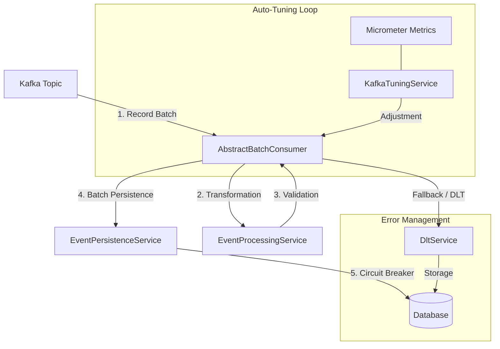

# Technical Documentation - Kafka Consumer Auto-tune

## 1. Executive Summary
**KafkaConsumerAutoTune** is a high-performance Spring Boot application designed to consume Kafka messages in batch mode, process them, and persist them. The application stands out for its intelligent **auto-tuning** engine based on a PID controller that dynamically adjusts parameters to optimize throughput. It integrates advanced error management (DLT, Fallback), protection via **Circuit Breaker**, and a complete observability stack (Loki, Prometheus, Jaeger, Grafana).

**Complementary Documents:**
- [Configuration Reference](docs/configuration.md)
- [Error Management and Resilience](docs/error-management.md)
- [Observability (Logging, Tracing, Metrics)](docs/observability.md)

---

## 2. Overall Architecture

The application follows a modular architecture. Data flows as follows:



---

## 3. Key Components in Detail

### 3.1 Kafka Consumption (AbstractBatchConsumer)
Manages the batch processing lifecycle with total genericity (`<T>`).
-   **Standardization**: Automatic DLT routing, metrics, and structured logs.
-   **Error Classification**: Distinguishes permanent errors (direct send to DLT) from transient errors (triggering Kafka retry).

### 3.2 Auto-Tune Engine (KafkaTuningService)
Monitors throughput and adjusts parameters to reach a target of **1.2 seconds** per batch.
-   **PID Controller**: Uses the formula `P*error + I*integral + D*derivative` to adjust `max.poll.records`. The error is calculated as `(Target - Actual) / Target`.
-   **Network Optimization**: Dynamically adjusts `fetch.min.bytes`, `fetch.max.wait.ms`, and `fetch.max.bytes` based on throughput (msg/s) and average message size.
-   **Internal Horizontal Scaling**: Adjusts `concurrency` (number of threads) based on CPU load and Kafka lag, without exceeding the number of partitions.
-   **Smoothing (EMA)**: Applies a smoothing coefficient (default alpha=0.2) on batch duration to avoid over-reacting to latency spikes.
-   **Survival Throttling**: If CPU or Memory exceeds 90%, the system reduces `max.poll.records` by 30% to avoid a crash.
-   **Interval measurement**: Batch duration and message size are measured over the window since the previous cycle, not over the process lifetime, so the controller keeps reacting to current conditions rather than to a lifetime average that flattens out as the process runs.
-   **Restart cooldown**: Applying any parameter restarts the listener container, so changes are gated by `min-restart-interval-ms` (default 5 minutes). A change proposed inside that window is discarded rather than queued, and re-proposed on the next cycle from fresh measurements. Nothing is committed to internal state until it has reached the consumer factory, so the values reported by the dashboard and the `kafkaTuning` health indicator always describe what the consumer is actually running. Emergency throttling is subject to the same cooldown.

All tuning parameters and their defaults are listed in the [Configuration Reference](docs/configuration.md#2-auto-tuning-kafkatuning).

### 3.3 Resilience and Circuit Breaker
Protects persistence via Resilience4j.
-   **Circuit Breaker**: Switches to `OPEN` in case of DB failure.
-   **Auto-Pause/Resume**: The Kafka consumer automatically stops and restarts according to the circuit state.
-   **Surgical Fallback**: In case of batch failure, the application attempts each message individually to isolate "poison messages" to the DLT while saving the rest of the batch.

---

## 4. Observability and Supervision

### 4.1 Centralization Stack
-   **Logs**: Centralized in **Loki** via Promtail. JSON ELK/ECS format natively supported.
-   **Traces**: Exported to **Jaeger** via OTLP.
-   **Correlation**: Support for Prometheus **Exemplars** allowing to jump from a metrics graph to a Jaeger trace with a single click.

### 4.2 Monitoring and Alerting
-   **Dashboards**: Technical Dashboard and Business KPI Dashboard provisioned in Grafana.
-   **Alerts**: Defined in `prometheus-rules.yml` on Kafka lag, error rate, and batch performance.

---

## 5. Technical Specifications
-   **Language**: Java 21 (Use of `record`).
-   **Framework**: Spring Boot 3.5.9.
-   **Database**: Oracle (or H2 in dev profile).
-   **Infrastructure**: Production-ready Docker Compose (Prometheus, Loki, Jaeger, Grafana).

---

## 6. Build and Test

```bash
./mvnw verify        # full suite, integration tests included
./mvnw spring-boot:run   # run locally on the dev profile (H2 in-memory)
```

Integration tests use an embedded Kafka broker and H2 rather than Testcontainers, so they need no
Docker daemon. `verify` is what CI runs on every push and pull request.

Note that the Docker image builds with `-DskipTests`: it packages an already-tested artefact and is
not itself a test gate.

---

## 7. Database Schema

The Oracle profile runs with `ddl-auto: validate`, so the schema must match the entities exactly or
the application will not start. `init.sql` is the source of truth and is idempotent: it creates
missing tables and sequences, and brings an existing schema up to date.

### Upgrading an existing Oracle schema

Re-run `init.sql` against the application schema. It will:

- add `DLT_EVENTS.SEVERITY` and `DLT_EVENTS.ORIGINAL_KEY` if absent;
- convert `DLT_EVENTS.PAYLOAD` and `DLT_EVENTS.ERROR_MESSAGE` from `VARCHAR2(4000)` to `CLOB`;
- create `RECOUVRABLE_EVENTS` and `RECOUVRABLE_SEQ` if absent.

The CLOB conversion rebuilds each column — add a CLOB, copy the data, drop the original, rename
into place — because Oracle rejects a direct `ALTER TABLE ... MODIFY` from `VARCHAR2` to a LOB type
(ORA-22858). **Take a backup before running it on a populated table.**

### A gap to be aware of

The `dev`, `local-h2` and `test` profiles generate their schema from the entities
(`ddl-auto: create-drop`), while production validates against this hand-written DDL. Nothing in the
test suite exercises the second path, so a mismatch between an entity and `init.sql` will not be
caught by the tests — it will surface as a startup failure, or as an insert that fails only once a
value exceeds the declared column width. Check both when changing an entity.
