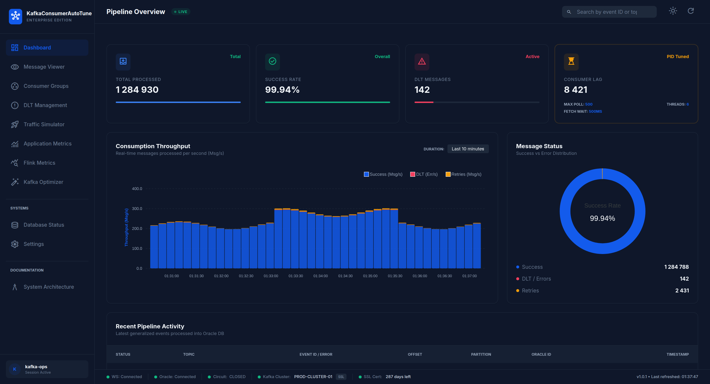
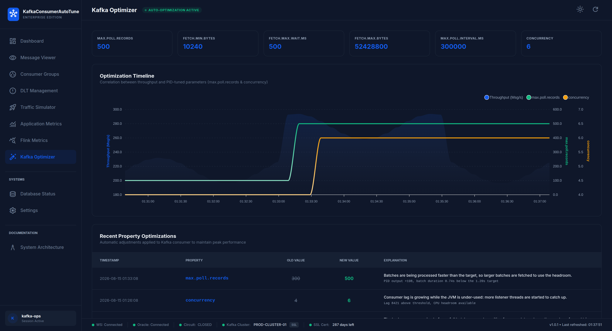
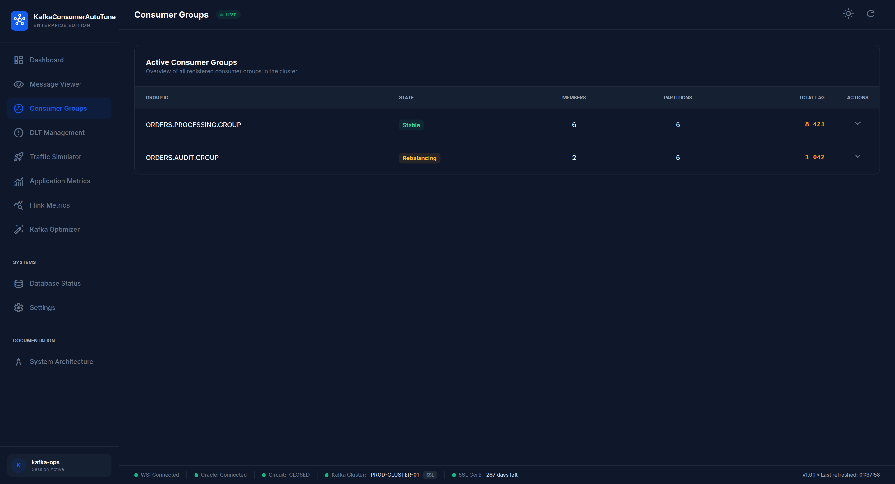
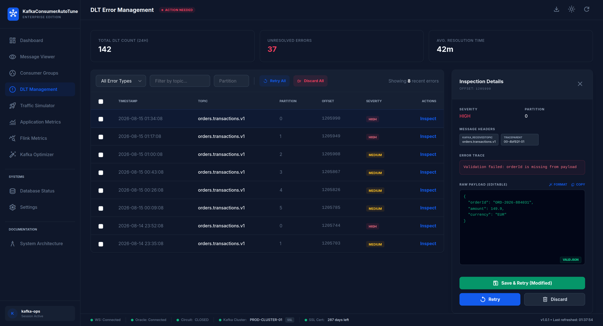

# KafkaConsumerAutoTune: The Intelligent Kafka Consumer

[](https://github.com/devdownin/kafkaconsumerautotune/actions/workflows/ci.yml)
[](https://github.com/devdownin/kafkaconsumerautotune/actions/workflows/codeql.yml)
[](LICENSE)
[](https://openjdk.org/projects/jdk/25/)

Welcome to **KafkaConsumerAutoTune**, a reference implementation of a high-performance Kafka consumer for Spring Boot. More than just a consumption tool, KafkaConsumerAutoTune is designed as a self-adaptive system capable of optimizing its own performance in real-time.



> Screenshots on this page show the interface with sample data; the figures in
> them are illustrative.

---

## Why KafkaConsumerAutoTune?

Traditionally, configuring a Kafka consumer is a guessing game:
- *How many messages should I take per batch (`max.poll.records`)?*
- *How long should I wait for the server (`fetch.max.wait.ms`)?*
- *How many threads do I need?*
- *How can I quickly generate test data that matches my complex business logic diagrams?*

If you set these values too low, you underutilize your resources. If you set them too high, you risk saturating your database or triggering incessant Kafka rebalances (the infamous "rebalance storm").

**KafkaConsumerAutoTune solves this by automating these settings and simplifying traffic generation.**

--

## Innovation: The "Cruise Control" (PID Controller)

Imagine you're driving a car. To maintain a constant speed, you don't press the accelerator at a fixed position. You adjust your pressure based on the slope, the wind, and the current speed.

KafkaConsumerAutoTune does exactly the same for Kafka using a **PID Controller** (Proportional, Integral, Derivative):
1. **Measurement**: It observes the real time taken to process a batch of messages.
2. **Target**: It has an objective (e.g., process each batch in exactly 1.2 seconds).
3. **Action**: If processing is too fast, it increases the number of messages per batch. If it slows down (e.g., the database is tired), it reduces the load instantly.

> **Result**: Constant optimal throughput, regardless of load or network health.

---

## Industrial-Grade Resilience

Real-world data processing is chaotic. KafkaConsumerAutoTune is built to survive the most common failures:

### 1. The Circuit Breaker
If your Oracle database goes down, KafkaConsumerAutoTune doesn't persist blindly. It "cuts the power":
- The Circuit Breaker transitions to the **OPEN** state.
- The Kafka consumer is automatically **paused** to avoid losing messages or saturating error logs.
- It resumes on its own as soon as the database is healthy again.

### 2. Individual Fallback Mode
This is the "surgical" mode. If a batch of 100 messages fails because of a single corrupted message (a "Poison Message"):
- KafkaConsumerAutoTune doesn't reject the entire batch.
- It retries each message **one by one**.
- The 99 healthy messages are saved.
- The faulty message is isolated and sent to the **DLT** (Dead Letter Topic).

---

## Full Observability

You can't improve what you don't measure. KafkaConsumerAutoTune offers:
- **Real-Time Dashboard**: Visualize throughput (msg/s), Kafka lag, and Optimizer interventions.
- **Distributed Tracing**: Trace every message from Kafka to the database via OpenTelemetry and Jaeger.
- **Structured Logs**: JSON format (ECS) ready for ELK, with automatic trace ID injection.

### The optimizer, and why it did what it did

Throughput is plotted against the two parameters the PID controller drives, so a
change in behaviour can be traced back to the adjustment that caused it. Every
adjustment is listed with the measurement that triggered it.



### Consumer groups, down to the partition

Lag is reported per partition rather than as a single number, which is what you
need when one partition is the one falling behind.



### Handling what failed

Messages routed to the Dead Letter Topic are listed with their origin and error.
The inspection panel shows the Kafka headers and the error trace, and lets you
correct the payload before replaying it — or discard it.



---

## Quick Start

### Prerequisites
- Docker and Docker Compose
- Java 25 (if you want to compile locally)

### Launch the complete stack
```bash
docker-compose up -d
```
This launches: Kafka, Oracle XE, Prometheus, Jaeger, and the KafkaConsumerAutoTune application.

> **Development credentials only.** The `docker-compose.yml` stack ships with
> deliberately trivial credentials (database `testpass`, Grafana `admin`/`admin`)
> so the demo runs out of the box. They are meant for a local machine and
> nothing else — never deploy this stack as-is. In any real environment, supply
> `DB_PASSWORD` and the `KAFKA_SSL_*` variables from your own secret store; the
> application reads them from the environment and hardcodes nothing.

### Using the published image

Released versions are published to Docker Hub:

```bash
docker pull devdownin/kafkaconsumerautotune:latest
```

Tags follow the release version: `1.0.1` also publishes `1.0`, `1` and
`latest`. Pre-releases (`1.0.1-rc1`) never take `latest`. Each image is also
tagged with its full commit SHA if you need to pin an exact build.

The image runs as an unprivileged user and exposes port 8080, with a
`HEALTHCHECK` on `/actuator/health`. It expects a reachable database — see the
environment variables in `docker-compose.yml` for the full list.

### Accessing the tools
- **KafkaConsumerAutoTune Dashboard**: [http://localhost:8080/dashboard](http://localhost:8080/dashboard)
- **Kafka Optimizer**: [http://localhost:8080/optimizer](http://localhost:8080/optimizer)
- **Jaeger (Traces)** : [http://localhost:16686](http://localhost:16686)

---

## Learn more
- [Detailed Technical Documentation](DOCUMENTATION.md)
- [Error Management](docs/error-management.md)
- [Observability](docs/observability.md)
- [Contributing Guidelines](CONTRIBUTING.md)
- [Changelog](CHANGELOG.md)
- [Security Policy](SECURITY.md)
- [Code of Conduct](CODE_OF_CONDUCT.md)

---

## License

This project is licensed under the Apache License 2.0 - see the [LICENSE](LICENSE) file for details.
