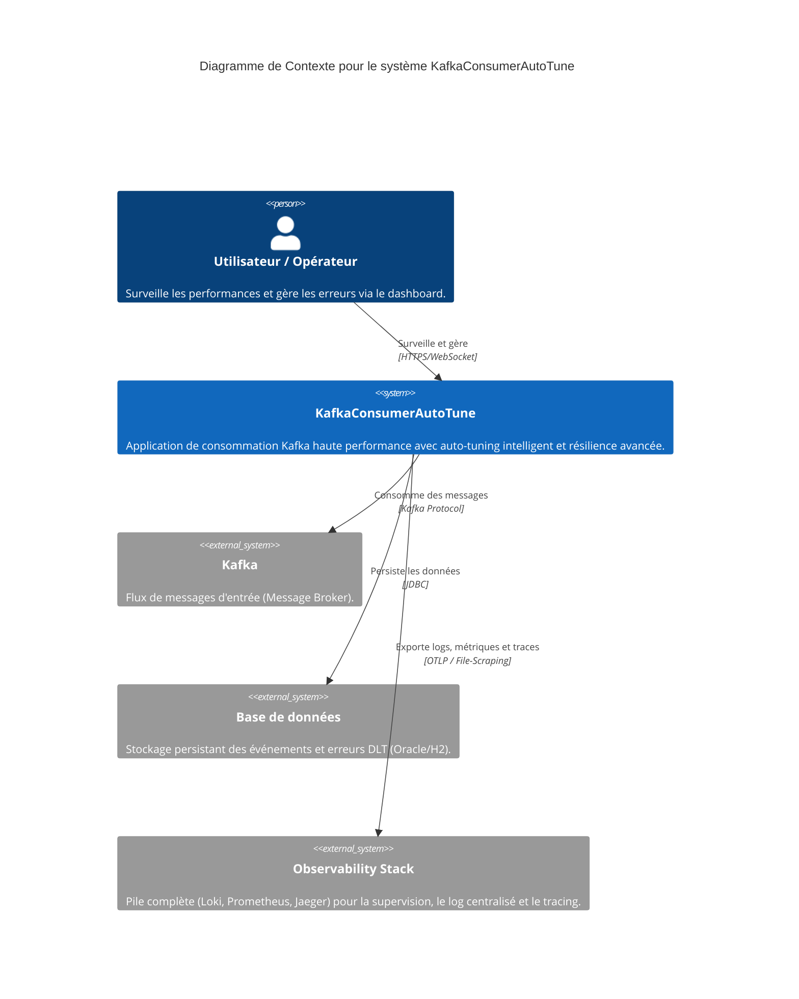
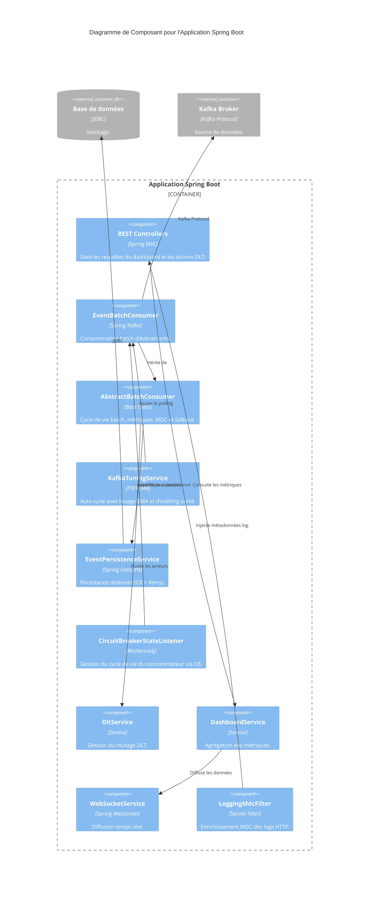

# Modèles C4 (Mermaid) - KafkaConsumerAutoTune

Ce document présente l'architecture de l'application KafkaConsumerAutoTune en suivant le modèle C4 (Context, Container, Component) au format Mermaid.

## 1. Niveau 1 : Diagramme de Contexte (System Context)

Ce diagramme montre le système KafkaConsumerAutoTune dans son environnement global.



---

## 2. Niveau 2 : Diagramme de Conteneur (Container)

Ce diagramme décompose le système KafkaConsumerAutoTune en conteneurs logiques et inclut la pile d'observabilité.

```mermaid
C4Container
    title Diagramme de Conteneur pour le système KafkaConsumerAutoTune

    Person(user, "Utilisateur / Opérateur", "Surveille les performances et gère les erreurs.")

    Container_Boundary(kafkaconsumerautotune_boundary, "Système KafkaConsumerAutoTune") {
        Container(ui, "Interface Web", "Thymeleaf, Tailwind CSS", "Fournit le dashboard et les outils de gestion DLT.")
        Container(app, "Application Spring Boot", "Java 25, Spring Boot 3.5", "Logique de consommation, auto-tuning (PID+EMA), résilience et export télémétrique.")
    }

    Container_Boundary(otel_boundary, "Pile d'Observabilité") {
        Container(collector, "OTel Collector", "OTLP", "Collecte et redirige les données OTLP.")
        Container(prometheus, "Prometheus", "Metrics Store", "Stockage des métriques avec support des Exemplars.")
        Container(loki, "Grafana Loki", "Log Store", "Centralisation des logs JSON.")
        Container(promtail, "Promtail", "Log Agent", "Collecte des logs via le file system.")
        Container(jaeger, "Jaeger", "Tracing", "Visualisation des traces distribuées.")
    }

    ContainerDb_Ext(database, "Base de données", "Relational (Oracle/H2)", "Stocke les événements et messages DLT.")
    Container_Ext(kafka, "Kafka Broker", "Message Broker", "Source des flux d'événements.")

    Rel(user, ui, "Interagit avec", "HTTPS")
    Rel(user, otel_boundary, "Consulte dashboards et logs", "HTTPS (Grafana)")
    Rel(ui, app, "Appels API & WebSocket", "HTTPS/WebSocket")
    Rel(app, database, "Lit/Écrit dans", "JDBC")
    Rel(app, kafka, "Consomme de", "Kafka Protocol")
    Rel(app, collector, "Exporte traces & métriques", "OTLP/HTTP")
    Rel(app, promtail, "Écrit logs JSON", "File system")
    Rel(promtail, loki, "Pousse logs", "HTTP")
    Rel(collector, jaeger, "Envoie traces", "OTLP/gRPC")
    Rel(collector, prometheus, "Expose métriques", "Prometheus Exporter")
```

---

## 3. Niveau 3 : Diagramme de Composant (Component)

Ce diagramme détaille les composants internes de l'application Spring Boot.


