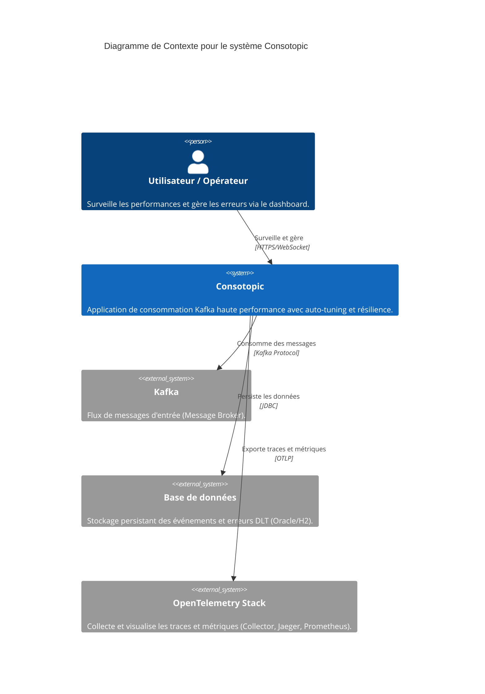
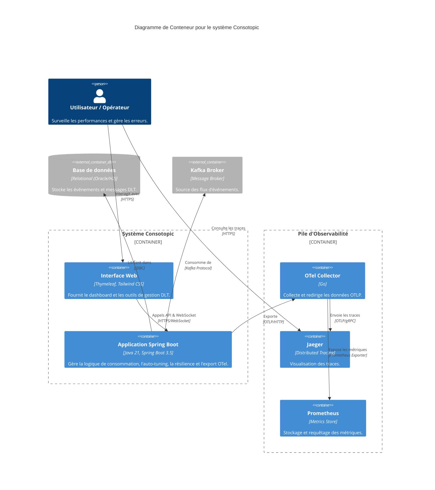
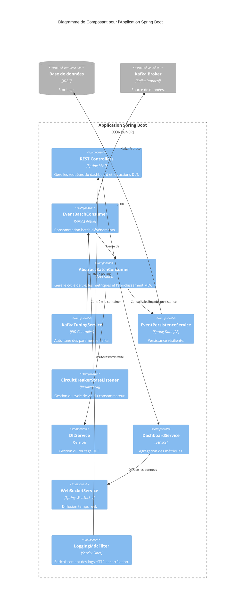

# Modèles C4 (Mermaid) - Consotopic

Ce document présente l'architecture de l'application Consotopic en suivant le modèle C4 (Context, Container, Component) au format Mermaid.

## 1. Niveau 1 : Diagramme de Contexte (System Context)

Ce diagramme montre le système Consotopic dans son environnement global, ses interactions avec les utilisateurs et les systèmes externes.

---

## 2. Niveau 2 : Diagramme de Conteneur (Container)

Ce diagramme décompose le système Consotopic en conteneurs logiques et inclut la pile d'observabilité.

---

## 3. Niveau 3 : Diagramme de Composant (Component)

Ce diagramme détaille les composants internes de l'application Spring Boot.

